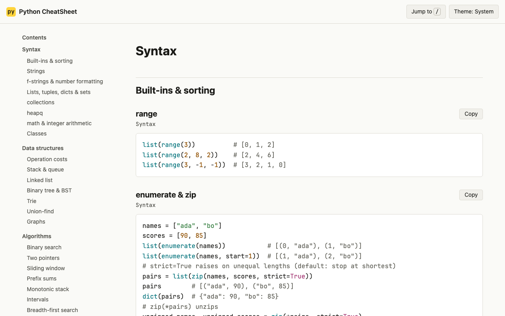
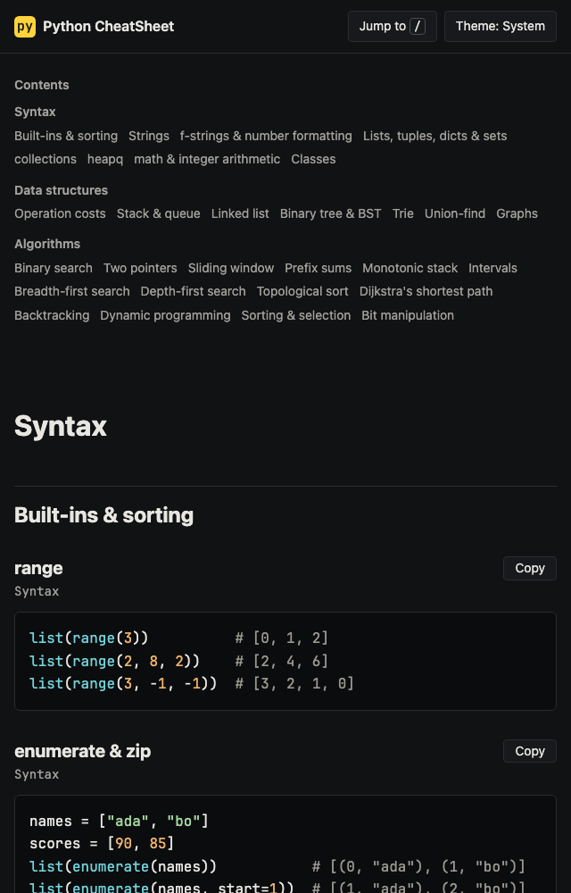
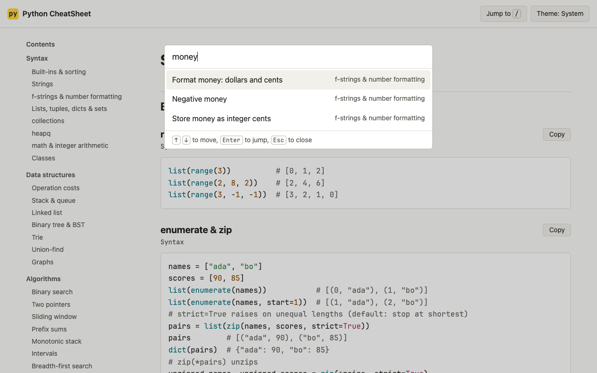

<div align="center">

# Python CheatSheet 🐍

<kbd>
    
</kbd>

## Project Description 🎨

Python CheatSheet is a single-page reference for Python coding interviews: <https://arieltyson.github.io/python-cheatsheet/>. It covers the syntax that is easy to forget under pressure (collections, heapq, math, f-strings and number formatting, including dollars and cents), the core data structures with the cost of every operation, and tested templates for the common algorithm patterns, from binary search to Dijkstra. Every snippet is idiomatic modern Python with optimal time and space complexity, and imports nothing beyond `collections`, `heapq` and `math`. The page is generated from real Python files by a build script that uses only the standard library, and CI runs every snippet's tests before deploying. All content is plain text on one page, so the browser's find (Cmd+F) always works. Pressing `/` opens a jump list for faster navigation.

## Screenshots:

<div style="display: flex; justify-content: center; align-items: center;">
    <kbd>
        
    </kbd>
    <kbd>
        
    </kbd>
    <kbd>
        
    </kbd>
</div>

## Technologies Used 💻

### Frameworks

- [x] **Python standard library**: `tomllib`, `ast`, `tokenize` and `html` power the static site build
- [x] **HTML, CSS and vanilla JavaScript**: one page, no framework, no bundler
- [x] **unittest**: tests for every snippet, the import allowlist, line length, colour contrast and the built page
- [x] **Ruff**: PEP 8 linting and formatting

### APIs & Web Services

- [x] **GitHub Pages**: static hosting
- [x] **GitHub Actions**: test, build and deploy on every push

### Data Sources

- [x] **snippets/**: the tested Python source shown on the page
- [x] **content/site.toml**: sections, titles, search aliases and complexity for all 111 entries
- [x] **web/tokens.toml**: every colour, as light and dark pairs

</div>

## Architecture 🏛️

- **Pattern**: Content as code. Tested `.py` snippets and a TOML manifest are compiled into one static HTML page by `tools/build.py`
- **Highlighting**: At build time with Python's `tokenize` module; no highlighting JavaScript ships to the browser
- **Results**: Demo snippets keep real `assert` lines so CI checks every documented result; the page shows them as `expression  # result`
- **State Management**: None besides the theme choice in `localStorage`
- **Quality Gates**: Ruff, unittest, an AST import allowlist, WCAG contrast tests, a Content-Security-Policy and gzipped size budgets must all pass before deploy
- **Target**: Snippets run on Python 3.10+; tooling runs on Python 3.12+ (CI uses 3.14); evergreen browsers

## Features 🚀

- 🔎 **Cmd+F friendly**: every word on the page is plain text, nothing collapsed or hidden
- ⚡ **Jump list**: press `/` and type "shortest path", "money" or "course schedule"
- 🧰 **Syntax**: built-ins, strings, f-strings and number formatting, collections, heapq and math
- 🧱 **Data structures**: operation cost tables plus linked list, tree, trie, union-find and graphs
- 🧭 **Algorithms**: binary search, two pointers, sliding window, BFS, DFS, topological sort, Dijkstra, backtracking, DP and more
- ⏱️ **Complexity on every snippet**: time and space stated in plain text
- 📋 **Copy buttons**: one click copies an entry's code
- 🌗 **Light and dark**: follows the system, with a manual toggle
- 🔒 **Private**: no cookies, analytics or third-party requests

## Running Locally 🛠️

```sh
python3 -m tools.build          # writes dist/index.html
python3 -m http.server -d dist  # open http://localhost:8000
python3 -m unittest             # every test
ruff check . && ruff format --check .
```

To add an entry, write the function (or a `demo_*` function with asserts) in `snippets/`, add tests in `tests/`, and add the entry to `content/site.toml`. The build fails if a snippet is missing from the manifest, imports outside the allowlist, or has a line over 72 characters.

## Privacy 🔏

Python CheatSheet does not use cookies, analytics or trackers. The only thing it stores is your light or dark theme choice, in your own browser. The site is hosted by GitHub Pages, which may log visitor IP addresses under the [GitHub Privacy Statement](https://docs.github.com/en/site-policy/privacy-policies/github-general-privacy-statement).

<div align="center">

## Contributing ⚙️

Contributions are welcome. Fork the repository, create a branch, add the snippet, its tests and its manifest entry, run `ruff check`, `ruff format --check` and `python3 -m unittest`, then open a pull request that explains what the entry is for. New entries must follow the import allowlist and keep each function within 25 lines.

## License 🪪

This project is licensed under the MIT License. See `LICENSE` for details. JetBrains Mono is used under the SIL Open Font License 1.1 (`web/fonts/OFL.txt`).

</div>
